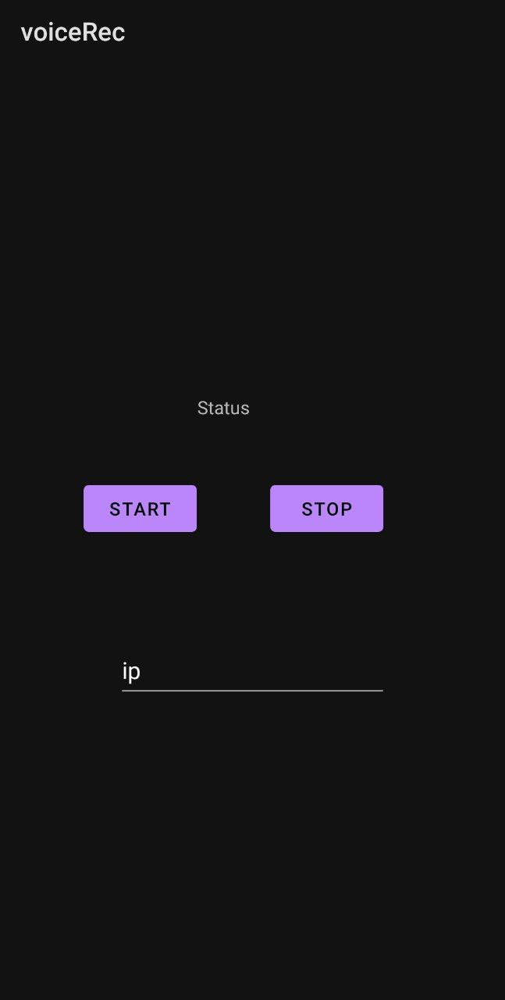

# Objective

The goal of this project was to create a dummy android apps that takes input from the mic forward it over sockets to the esp_32, where a speech recognition model is running that recognizes the command and based on that the esp32 Turn the LED ON or OFF

# Structure

- `esp`: that folder includes micropython code for the esp32
> Don't forget to edit `wifi.connect('ssid_name','P@ssw0rd')` this line and add your own network credentials
> 
> [This video](https://www.youtube.com/watch?v=IXHV6xbSO14) shows how the model is trained
- `voiceRec`: The Android studio app files

